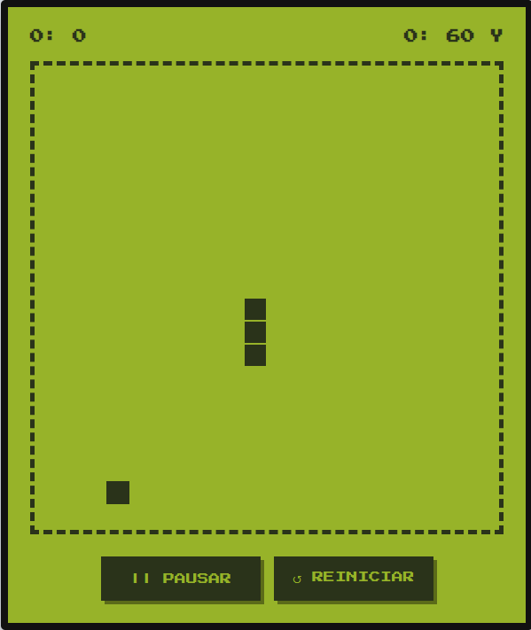

# 🐍 Snake Clásico | Estilo Nokia 3310

Un clon del mítico juego Snake de los teléfonos Nokia, desarrollado con Vanilla JavaScript, aplicando Programación Orientada a Objetos (POO) y buenas prácticas de Clean Code. 

* **[🎮 Jugar ahora en vivo](https://michelmassaad.github.io/juego-snake/)**



## 👾 Características del Proyecto

* **Estética Retro Realista:** Diseño inspirado en las pantallas LCD de matriz de puntos (fósforo verde), utilizando variables CSS nativas y la tipografía pixelada `Press Start 2P`.
* **Motor de Juego POO:** Toda la lógica está encapsulada en la clase `JuegoSnake`, separando el estado del juego del renderizado en el DOM para mayor escalabilidad.
* **Mecánica "Pac-Man":** Efecto *wrap-around* implementado. Si la serpiente atraviesa un borde, aparece por el lado opuesto.
* **Dificultad Progresiva:** El motor aumenta la velocidad del ciclo de juego (frame rate) progresivamente a medida que aumenta el puntaje.
* **Persistencia de Datos:** El puntaje máximo histórico (High Score) se guarda automáticamente en el `localStorage` del navegador.
* **Controles Físicos y de Teclado:** Soporte para jugar con teclado (Flechas, WASD) y botones en pantalla interactivos, incluyendo función de Pausa y Reinicio.

## 🛠️ Tecnologías Utilizadas

* **HTML5:** Estructura semántica.
* **CSS3:** Flexbox, CSS Grid (para el renderizado del tablero por coordenadas exactas) y animaciones de keyframes (efecto parpadeo).
* **JavaScript (ES6+):** Lógica orientada a objetos, manejo de eventos y manipulación dinámica del DOM sin librerías externas.

## 💻 Instalación y Uso Local

Estos pasos permiten ejecutar el juego en tu equipo para jugar, explorar el código o realizar modificaciones:

```bash
# clonar el repositorio
git clone https://github.com/michelmassaad/juego-snake.git
cd juego-snake
```

1. Abre el archivo `index.html` con tu navegador favorito.
   - Alternativamente, puedes iniciar un servidor local (por ejemplo con la extensión **Live Server** de VS Code o `python -m http.server`) para evitar restricciones de CORS al cargar recursos.
2. Juega con el teclado (Flechas o WASD) o usa los botones táctiles en pantalla. Puedes pausar con la tecla `P` y reiniciar con `R`.

> 🔧 Este proyecto no requiere dependencias externas ni compilación; está construido con HTML/CSS/JS puros.

## 🤝 Contribuciones

Si te interesa ampliar el juego o mejorar el código, eres bienvenido a:

1. Abrir un *issue* describiendo tu idea o reporte.
2. Crear un *fork* y un *pull request* con tus cambios.

## ℹ️ Autor

**Michel Massaad** – Estudiante de Sistemas (UTN) y desarrollador de software.

*GitHub:* [@michelmassaad](https://github.com/michelmassaad)

---

Gracias por jugar y revisar el código. ¡Espero que te diviertas y aprendas algo nuevo! 🎉